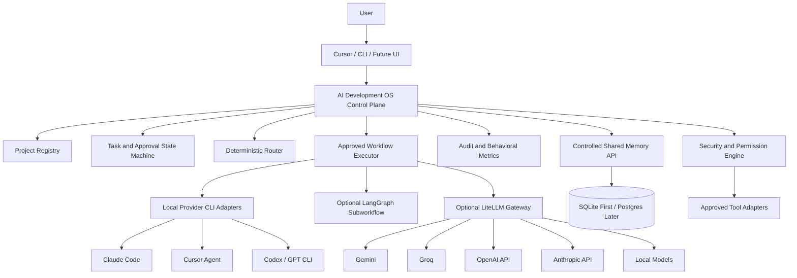

# AI Operating System — Open-Source Integration Master Blueprint

## Purpose

This document is the master Cursor-ready blueprint for evolving the existing **AI Development OS** into a broader, modular **AI Operating System platform**.

It combines the key findings from the open-source research, the current AI Development OS architecture, and the multi-model orchestration vision.

The goal is not to replace the existing AI Development OS. The goal is to keep it as the trusted control layer and add replaceable open-source components around it.

---

# 1. Final Recommendation

## Keep the current AI Development OS

The existing `ai-development-os` repository should remain the main source of truth for:

- project registration;
- task lifecycle;
- deterministic routing;
- planning and approval gates;
- fingerprints and reproducibility;
- safe Git and worktree handling;
- provider execution policies;
- implementation, test, review, and repair loops;
- behavioral metrics;
- audit history;
- security boundaries;
- human approval for sensitive work.

Do not replace this foundation with AIOS, LangGraph, OpenHands, CrewAI, AutoGen, or another framework.

## Use open-source systems as optional components

Recommended role division:

```text
Cursor
    = main working interface and cockpit

AI Development OS
    = policy, lifecycle, approvals, safety, routing authority, audit

LiteLLM
    = universal model gateway for API-based providers

LangGraph
    = optional executor for approved complex sub-workflows

AIOS
    = architectural reference for kernel, scheduling, memory, tools, and access control

Agent OS / CC-SDD-style tools
    = specification and coding-standard plugins

OpenHands
    = optional future agent UI/server, not the core

Shared Memory Service
    = controlled project memory available to approved agents

Claude / Cursor / Codex or GPT
    = specialized workers with separate responsibilities
```

---

# 2. Where This Should Live

## Primary location

This blueprint should live inside:

```text
C:\Users\Taha\ai-development-os\docs\AI_OS_OPEN_SOURCE_INTEGRATION_MASTER_BLUEPRINT.md
```

Recommended companion documents:

```text
docs/
├── AI_OS_OPEN_SOURCE_INTEGRATION_MASTER_BLUEPRINT.md
├── AI_OS_COMPONENT_DECISIONS.md
├── AI_OS_MEMORY_DESIGN.md
├── AI_OS_PROVIDER_STRATEGY.md
├── AI_OS_SECURITY_BOUNDARIES.md
└── AI_OS_ROADMAP.md
```

## Why it belongs in `ai-development-os`

This work directly extends the purpose of the existing project:

- coordinating Claude, Cursor, Codex/GPT, and future models;
- creating durable cross-agent workflows;
- enforcing project boundaries;
- controlling execution;
- measuring model behavior;
- moving from manual handoff toward safe automation.

Therefore, do not create a separate repository yet.

## When a separate repository may become justified

Create a separate platform repository only when all of these become true:

1. The kernel, memory, routing, and provider layers serve non-development products.
2. Multiple applications depend on the same platform.
3. AI Development OS becomes only one application on top of the shared platform.
4. Independent versioning and deployment become necessary.

Possible future split:

```text
universal-ai-platform/
    kernel, memory, routing, providers, tools, audit

ai-development-os/
    software-development workflows built on the platform

ai-research-os/
    research workflows

ai-business-os/
    back-office workflows
```

Until then, a split would add unnecessary complexity.

---

# 3. Relationship With the Three-Model Agent in Cursor

The three-model Cursor workflow should remain active, but it must become a client of AI Development OS rather than a separate competing orchestrator.

Recommended responsibilities:

## Claude

Use Claude for:

- architecture;
- planning;
- ambiguous requirements;
- high-risk reasoning;
- security analysis;
- difficult debugging;
- disagreement resolution;
- sensitive final review.

## Cursor

Use Cursor for:

- repository navigation;
- implementation from an approved plan;
- small and medium changes;
- tests;
- refactoring;
- UI work;
- diff review;
- local development workflow.

## Codex / GPT

Use Codex or GPT for:

- independent review;
- adversarial analysis;
- test-gap detection;
- missing-requirement detection;
- report verification;
- behavioral analysis;
- second-opinion reasoning.

## Required relationship

```text
User goal
    ↓
AI Development OS creates and validates task
    ↓
Claude plans
    ↓
Human or policy gate approves plan
    ↓
Cursor implements
    ↓
Tests execute
    ↓
Codex/GPT independently reviews
    ↓
Bounded repair loop if required
    ↓
AI Development OS records outcome and updates approved memory
```

Do not let the Cursor three-model setup maintain a separate task lifecycle, approval database, routing history, or project memory.

---

# 4. Core Design Principles

1. **Deterministic software before AI.**
   Use code for validation, arithmetic, filtering, permissions, state transitions, budgets, retries, deduplication, and security.

2. **One lifecycle authority.**
   AI Development OS owns task state. LangGraph or other frameworks may execute approved subflows but cannot become a second source of truth.

3. **One project registry.**
   Unregistered projects remain inaccessible.

4. **Fail closed.**
   Missing permission, invalid state, stale fingerprint, ambiguous provider, or unauthorized path must stop execution.

5. **Models have roles, not unrestricted authority.**
   Models perform bounded jobs and return structured results.

6. **Memory is evidence, not truth by default.**
   Every important memory must include source, scope, timestamp, status, and confidence.

7. **Open-source components must be replaceable.**
   Integrate through adapters and contracts rather than embedding framework logic throughout the core.

8. **Measure outcomes before learning routing behavior.**
   Do not trust model self-confidence as performance evidence.

9. **Start local and simulated.**
   Add live providers, network tools, browser control, or shared services only through explicit rounds and approval gates.

10. **Do not install everything.**
    Every dependency must solve a proven problem.

---

# 5. Target Architecture



---

# 6. Component Decisions

## 6.1 AI Development OS

**Decision:** Keep and expand.

It remains responsible for governance and lifecycle.

Already valuable capabilities include:

- project boundaries;
- plans and approvals;
- immutable fingerprints;
- worktree isolation;
- safe command execution;
- provider contracts;
- simulation modes;
- bounded orchestration;
- testing and review gates;
- repair limits;
- behavioral reporting.

## 6.2 LiteLLM

**Decision:** Add later as an optional provider gateway.

Use LiteLLM for:

- unified API provider access;
- model aliases;
- retries and fallbacks;
- cost and token tracking;
- rate limits;
- normalized errors;
- key and budget controls;
- API-provider load balancing.

Do not use LiteLLM for:

- task lifecycle;
- project permissions;
- determining truth;
- planning;
- approval decisions;
- memory governance;
- business workflow state.

Important distinction:

- local subscription-backed CLIs may use provider CLI adapters;
- API-based providers may use LiteLLM;
- these must remain separate execution modes.

## 6.3 LangGraph

**Decision:** Optional, only for complex approved sub-workflows.

Use LangGraph when a workflow truly needs:

- branching;
- durable checkpoints;
- long-running tool chains;
- human interruption and resume;
- complex agent graphs.

Do not migrate the entire AI Development OS state machine into LangGraph.

Recommended contract:

```text
AI Development OS approves a workflow request
    ↓
LangGraph executes within a bounded contract
    ↓
LangGraph returns a versioned result envelope
    ↓
AI Development OS validates and records the result
```

## 6.4 AIOS

**Decision:** Study first; do not adopt directly yet.

Useful AIOS ideas:

- kernel-style service boundaries;
- scheduler queues;
- context management;
- memory manager;
- storage manager;
- tool manager;
- access/verifier manager;
- agent syscall abstraction.

Risks:

- research-grade maturity;
- architecture mismatch;
- duplicated scheduling and memory logic;
- difficult upgrades;
- excessive complexity;
- risk of weakening current safety guarantees.

Only adopt code after a bounded proof shows clear value over the existing design.

## 6.5 Agent OS and CC-SDD-style systems

**Decision:** Use as pattern or optional skill, not core infrastructure.

Useful ideas:

- durable specifications;
- project conventions;
- approved requirements before implementation;
- spec-driven workflows;
- independent review;
- reusable development standards.

The current system already independently implements many of these ideas.

Avoid:

- duplicate task states;
- auto-approval flags;
- uncontrolled autonomous loops;
- copying large skill libraries into always-loaded context.

## 6.6 OpenHands

**Decision:** Defer.

Possible future uses:

- team-facing agent control center;
- remote agent server;
- GitHub or Slack-triggered workflows;
- web interface for agent sessions.

Do not use it now because:

- Cursor is already the main interface;
- it adds a heavy web stack;
- it overlaps with current execution and UI goals;
- it could become another orchestration authority.

## 6.7 Agent Orchestrator, MCO, Liza, and Ralphex

Use proven patterns only:

- worktree/session isolation;
- provider adapter contracts;
- explicit lifecycle state machines;
- planner/reviewer separation;
- maximum repair rounds;
- stalemate detection;
- normalized structured outputs.

Much of this is already present in AI Development OS.

---

# 7. Shared Memory Design

## 7.1 Start simple

Use SQLite first. Do not begin with Neo4j, FalkorDB, Redis, pgvector, Graphiti, Mem0, and Letta together.

Recommended first tables:

```text
projects
facts
project_decisions
approved_plans
task_outcomes
model_performance
known_failures
user_preferences
memory_sources
memory_revisions
```

## 7.2 Memory classes

### Authoritative memory

Examples:

- approved project rules;
- accepted architectural decisions;
- current configuration versions;
- approved plan fingerprints;
- verified test commands;
- human-approved business rules.

### Observational memory

Examples:

- model performed well on a task type;
- a provider timed out;
- a repair round found a specific defect;
- a prompt version produced malformed JSON.

### Temporary memory

Examples:

- active task notes;
- intermediate summaries;
- short-lived retrieved context;
- unverified model suggestions.

### Rejected or superseded memory

Never silently delete historical facts. Mark them:

```text
active
superseded
rejected
expired
unverified
```

## 7.3 Required fields

Every important memory item should contain:

```yaml
memory_id:
project_id:
category:
content:
source_type:
source_reference:
created_by:
created_at:
status:
confidence:
valid_from:
valid_until:
supersedes:
security_classification:
```

## 7.4 Write permissions

Recommended rules:

- agents may propose memory;
- deterministic validators may automatically store operational events;
- only approved processes may promote a proposal into authoritative memory;
- high-risk policy memory requires human approval;
- one project cannot read another project's memory unless explicitly authorized;
- sensitive content must not be sent to unapproved providers.

## 7.5 Future memory upgrades

Move from SQLite to Postgres/pgvector only when:

- memory volume makes SQLite inadequate;
- semantic search is proven necessary;
- multiple processes need concurrent writes;
- team or server deployment is required.

Add a graph database only when relationship queries become a real bottleneck.

---

# 8. Provider and Driver Architecture

## 8.1 One common contract

Every model or tool adapter should expose:

```text
discover()
capabilities()
prepare_request()
execute()
normalize_result()
health_check()
redact()
record_usage()
```

## 8.2 Execution modes

Every provider must declare one mode:

```text
disabled
simulation
manual_handoff
local_cli
api
local_model
```

Never treat consumer subscription access and API access as the same thing.

## 8.3 Logical roles

Use role names instead of hard-coding providers:

```text
architecture-planner
implementation-worker
independent-reviewer
fast-classifier
document-reader
vision-worker
research-worker
security-reviewer
final-synthesizer
```

Routing maps roles to currently eligible providers.

## 8.4 Structured output envelope

Minimum fields:

```json
{
  "schema_version": "1.0",
  "request_id": "...",
  "task_id": "...",
  "project_id": "...",
  "provider_id": "...",
  "model_id": "...",
  "role": "independent-reviewer",
  "status": "success",
  "summary": "...",
  "evidence": [],
  "assumptions": [],
  "missing_information": [],
  "findings": [],
  "tests": [],
  "usage": {},
  "timing": {},
  "failure_class": null
}
```

---

# 9. Routing and Model Reputation

## 9.1 Initial routing

Start with transparent deterministic rules.

Example:

```text
Architecture or high risk -> Claude
Approved implementation -> Cursor
Independent review -> Codex/GPT
PDF or image -> Gemini through an approved API route
Fast bulk classification -> Groq or local model
Sensitive private data -> local-only eligible provider
```

## 9.2 Model reputation system

Track actual outcomes:

- task type;
- provider and model;
- prompt version;
- tests passed or failed;
- reviewer findings;
- confirmed defects;
- repair rounds;
- completion time;
- token usage;
- cost;
- malformed-output rate;
- user correction;
- final acceptance;
- provider failure rate.

Do not use model-provided confidence as the main score.

## 9.3 Learning policy

The system may recommend routing changes, but it must not automatically activate them.

Required process:

```text
Collect outcomes
    ↓
Generate recommendation
    ↓
Run evaluation dataset
    ↓
Compare against current policy
    ↓
Human review
    ↓
Versioned policy change
```

---

# 10. Verification Engine

The verifier should combine deterministic checks and independent model review.

Checks may include:

- JSON/schema validity;
- required-field presence;
- file-scope compliance;
- Git state and fingerprint match;
- command and test evidence;
- calculation verification;
- citation/source checks;
- contradictions;
- missing acceptance criteria;
- secret and PII leakage;
- prohibited action checks;
- unsafe tool calls;
- result reproducibility.

Do not rely on majority voting alone. If models disagree:

1. isolate the disputed claim;
2. inspect original evidence;
3. run deterministic checks;
4. ask a verifier about the narrow dispute;
5. escalate to Claude or a human when unresolved;
6. preserve uncertainty in the final record.

---

# 11. Tool and Plugin Ecosystem

## 11.1 Plugin principle

Plugins must be thin adapters with clear permission declarations.

Possible plugin categories:

```text
providers/
workflow_engines/
memory_backends/
tools/
connectors/
validators/
reporters/
interfaces/
```

## 11.2 Tool permissions

Each tool must declare:

- readable paths;
- writable paths;
- network destinations;
- required secrets;
- allowed operations;
- approval level;
- timeout;
- maximum output;
- audit requirements;
- rollback capability.

## 11.3 Future tools

Possible future integrations:

- GitHub;
- Google Drive;
- Slack;
- Jira;
- Linear;
- Notion;
- Playwright;
- Docker;
- PostgreSQL;
- browser search;
- Windows automation.

Add one at a time, starting read-only.

---

# 12. Digital Employees

Do not expose raw models as the primary product interface.

Future users should select roles such as:

- Software Architect;
- Implementation Engineer;
- Code Reviewer;
- Research Analyst;
- Real Estate Analyst;
- CPA Analyst;
- Medical Billing Analyst;
- QA Engineer;
- Security Reviewer.

A digital employee is a versioned configuration containing:

```yaml
employee_id:
mission:
allowed_projects:
allowed_tools:
required_model_roles:
workflow_template:
input_schema:
output_schema:
approval_rules:
memory_scope:
evaluation_suite:
budget_policy:
```

The OS decides which models and tools fulfill the role.

---

# 13. Security Architecture

Non-negotiable rules:

- separate identity per agent or service;
- least-privilege tokens;
- no secrets in prompts, logs, Git, or result envelopes;
- project-scoped access;
- no arbitrary shell execution;
- subprocess argument arrays only;
- strict timeouts and output limits;
- allowlisted commands;
- path normalization and symlink escape protection;
- approval for external writes;
- no automatic credential fallback;
- sensitive-data classification before provider calls;
- append-only audit events;
- sandbox/worktree isolation;
- network disabled by default;
- human approval for irreversible or high-risk operations;
- no self-modifying safety policy.

---

# 14. Recommended Repository Structure

Keep the current repository structure and extend it gradually:

```text
ai-development-os/
├── config/
│   ├── projects.yaml
│   ├── routing/
│   ├── providers/
│   ├── memory/
│   ├── policies/
│   └── workflows/
├── docs/
│   ├── AI_OS_OPEN_SOURCE_INTEGRATION_MASTER_BLUEPRINT.md
│   ├── architecture/
│   ├── decisions/
│   ├── security/
│   ├── providers/
│   └── memory/
├── schemas/
│   ├── tasks/
│   ├── plans/
│   ├── providers/
│   ├── memory/
│   ├── workflows/
│   └── reports/
├── src/ai_dev_os/
│   ├── core/
│   │   ├── lifecycle/
│   │   ├── approvals/
│   │   ├── policies/
│   │   ├── routing/
│   │   └── audit/
│   ├── providers/
│   │   ├── contracts/
│   │   ├── cli/
│   │   ├── api/
│   │   ├── simulation/
│   │   └── local/
│   ├── workflows/
│   │   ├── native/
│   │   └── langgraph_adapter/
│   ├── memory/
│   │   ├── contracts/
│   │   ├── sqlite_backend/
│   │   └── governance/
│   ├── tools/
│   ├── validators/
│   ├── reports/
│   └── interfaces/
├── tests/
│   ├── unit/
│   ├── integration/
│   ├── security/
│   ├── orchestration/
│   └── evaluation/
└── workspace/
```

Do not perform a large repository-wide restructure in one round. Migrate only when a feature requires it.

---

# 15. Phased Roadmap

## Phase A — Preserve and document current baseline

- keep all existing tests green;
- add this blueprint;
- document component decisions;
- define terms: OS, kernel, provider, workflow, employee, memory;
- record non-goals;
- no new dependencies.

## Phase B — Controlled shared memory prototype

- SQLite backend;
- project-scoped memory;
- memory proposal and approval states;
- source and revision tracking;
- CLI commands for store/search/show/supersede;
- no MCP and no vector database yet;
- simulation tests only.

## Phase C — Real three-model lifecycle

- one real local CLI provider for implementation;
- a different provider for review;
- existing task/plan/worktree controls remain authoritative;
- strict invocation and output contracts;
- bounded live smoke test;
- no Equitify connection.

## Phase D — Provider gateway

- integrate LiteLLM behind the provider interface;
- API mode clearly separated from subscription CLI mode;
- model aliases;
- usage and budget controls;
- one API provider at first;
- simulated tests before any live call.

## Phase E — Complex workflow adapter

- evaluate whether native orchestration is insufficient;
- add a LangGraph adapter only for a selected complex workflow;
- AI Development OS owns lifecycle and approvals;
- LangGraph returns a normalized envelope;
- test pause, resume, timeout, and cancellation.

## Phase F — Reputation-based routing recommendations

- collect enough real outcome data;
- create baseline evaluation tasks;
- generate recommendations;
- no automatic activation;
- compare quality, cost, latency, and repair rates.

## Phase G — Digital employee layer

- define reusable employee manifests;
- map employees to approved workflows;
- give each employee scoped memory and tools;
- pilot with Software Engineer and Reviewer employees.

## Phase H — Optional UI and external tools

- determine whether Cursor is sufficient;
- add a lightweight status UI only if needed;
- consider OpenHands only for team/server use;
- add external connectors one at a time.

## Phase I — Platform extraction decision

Evaluate whether to split a universal platform from AI Development OS.

Do not split based only on ambition. Split only after reuse across multiple real applications is proven.

---

# 16. MVP Definition

The next meaningful MVP is not a universal AI OS dashboard.

It is:

> A registered synthetic project moves through approved planning, implementation by one real provider, targeted testing, independent review by another provider, bounded repair, audited completion, and controlled shared-memory updates.

MVP success criteria:

- no manual copy-paste between providers for the tested path;
- plan approval remains mandatory;
- worktree isolation remains intact;
- only approved commands execute;
- every provider response validates against schema;
- reviewer is independent;
- repair loop is bounded;
- memory writes include evidence and project scope;
- full audit history exists;
- no Equitify access;
- no unapproved API spending;
- tests prove failure behavior.

---

# 17. Things Not to Do

- Do not replace AI Development OS with AIOS.
- Do not allow Cursor, LangGraph, and the OS to maintain competing task states.
- Do not connect every model to every task.
- Do not send the same sensitive input to several providers without need.
- Do not treat majority agreement as truth.
- Do not trust confidence scores without evidence.
- Do not store full conversations as permanent memory by default.
- Do not allow agents to rewrite routing or security policy automatically.
- Do not enable all MCP servers.
- Do not add OpenHands before a UI need is proven.
- Do not introduce Neo4j, Redis, Postgres, pgvector, and a vector framework simultaneously.
- Do not assume ChatGPT or Claude subscriptions equal API credits.
- Do not make free-tier providers a production reliability dependency.
- Do not build digital employees before workflows and permissions are stable.
- Do not connect Equitify until explicitly authorized.
- Do not perform a major architecture rewrite without compatibility tests and migration evidence.

---

# 18. Questions to Ponder Before Each Major Round

1. What exact problem does this component solve that the current OS cannot?
2. Can the feature be implemented with the existing state machine?
3. Does the new component become another source of truth?
4. Can it be placed behind an adapter?
5. What happens when it is unavailable?
6. How will it be tested without live provider calls?
7. What data may it read, write, store, or transmit?
8. How is rollback performed?
9. What new dependency and maintenance burden does it add?
10. Does it work reliably on Windows?
11. Is its license verified for the exact version used?
12. Will it weaken reproducibility or auditability?
13. What measurable success criterion justifies keeping it?
14. Can the same result be achieved with less complexity?
15. Is this required now, or only attractive as a future idea?

---

# 19. Cursor Instructions for Using This Blueprint

When Cursor receives this document:

1. Treat it as architectural guidance, not permission to implement everything.
2. Inspect the current repository and latest project chronicle first.
3. Preserve all current boundaries and tests.
4. Work in one explicitly approved round at a time.
5. Do not add dependencies without approval.
6. Do not connect Equitify.
7. Do not activate live providers unless the round explicitly authorizes them.
8. Prefer small compatible changes over broad restructuring.
9. Produce a design before implementation for medium or large changes.
10. Include tests for normal, invalid, stale, duplicate, resume, and failure behavior.
11. Record exact commands and results.
12. End every round with a concise report covering changes, tests, risks, and next allowed action.

---

# 20. Cursor Planning Prompt

```text
Review docs/AI_OS_OPEN_SOURCE_INTEGRATION_MASTER_BLUEPRINT.md together with the latest project chronicle and current repository state.

Do not edit files yet.

Determine the smallest next implementation round that advances the AI Operating System vision without replacing or weakening the current AI Development OS.

The plan must include:

1. current verified baseline;
2. exact problem being solved;
3. why the existing architecture cannot already solve it;
4. smallest safe design;
5. files expected to change;
6. schema and compatibility impact;
7. security and privacy impact;
8. Windows compatibility;
9. dependency decision;
10. tests required;
11. rollback method;
12. explicit out-of-scope items;
13. whether any live provider, network, API, or Equitify access is required;
14. completion criteria.

Do not implement multiple roadmap phases together.
Do not add a framework merely because it appears in the research.
Treat AI Development OS as the lifecycle, policy, approval, and audit authority.
```

---

# 21. Recommended Immediate Next Action

Add this document to the `ai-development-os/docs/` directory and ask Cursor to compare it against the current Round 4+ repository state.

The next implementation round should most likely be a **controlled shared-memory design and SQLite prototype**, unless the current repository already contains a more urgent approved Round 4 milestone.

Do not start by importing AIOS, LangGraph, OpenHands, or a large memory framework.

---

# 22. Final Principle

> Keep the AI Development OS as the trusted controller. Add open-source systems only as replaceable workers or services. Build one proven capability at a time, measure it, and preserve safety, auditability, and human authority.
